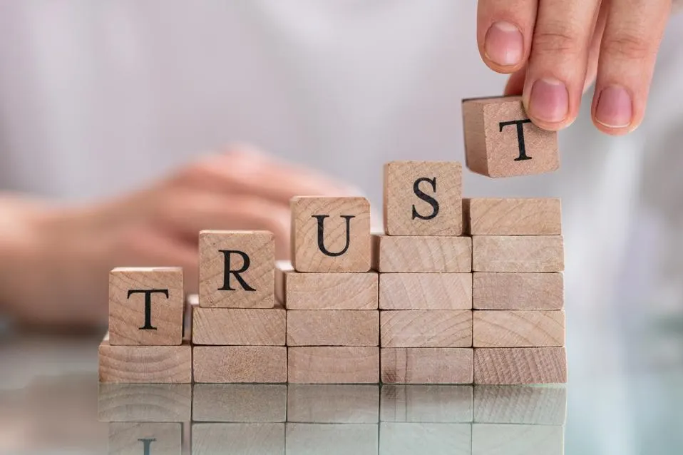

> 
Earning Trust is a tall task that every team member should strive for, especially for those who wants to progress in their fields

#### 1.  Situation : Started working as a floor staff in a the second branch for a well known family managed restaurant, as most business do they over hire in the ealry stages so they could secure the number needed, and from there filter them out, and not only i wanted to be from team A i needed more hours as well 

#### 2.  Task : In order to get called in for more hours i have to prove my ability and skills in hanlding customers and gaining my manager trust, the rest of the staff so when my name is mentioned they will back me up in asserting that i am to be trusted with the responsibility given so i had to stand out from the rest of the floor staff 

 #### 3. Action : I took the job seriously and started to go above and beyond
 1. always on time, well presented, i used different perfume every week to show that i am keeping myself in check. 
 1. That  involve me relocating from my current place to a closer one to work, so they could relay on me having to during closing late hours and early openings. 

>
Daily 8 mins walk to work after relocating 

 ####  4. Results : After not to long i was indeed able to gain not only my manager but the owenrs trust so i was the only floor staff member allowed to handle the cash register beside my manager, and i was able to secure the hours i wanted plus a promotion to be an assistant manager in a span of 6 months, and being one of the key hanlders. 

